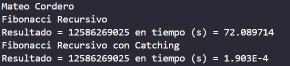

# Práctica de Algoritmos de Ordenamiento

## 📌 Información General

- *Título:* Práctica de Catch
- *Asignatura:* Estructura de Datos
- *Carrera:* Computación
- *Estudiante:* Miichael Yumbla
- *Fecha:* 15/07/2025
- *Profesor:* Ing. Pablo Torres

---

## 🛠 Descripción

Tu programa calcula números de Fibonacci usando dos métodos: uno recursivo simple y otro con memoización (programación dinámica).

- El método recursivo simple (getFibonaci) funciona bien para números pequeños, pero para valores grandes (como 100) es muy lento y puede tardar demasiado.

- El método con memoización (getFibonaciPD) guarda resultados intermedios en un mapa para evitar cálculos repetidos, haciendo que calcular Fibonacci para valores grandes sea rápido y eficiente.

En la clase principal (App), es importante usar variables de tipo long para almacenar resultados, ya que los números de Fibonacci crecen rápido y superan el límite de int. Además, se recomienda medir el tiempo en milisegundos para facilitar la lectura.

---

## 🚀 Ejecución

Para ejecutar el proyecto:

1. Compila el código:
    bash
    javac App.java
    
2. Ejecuta la aplicación:
    bash
    java App
    

---

## 🧑‍💻 Ejemplo de Entrada

````plaintext
Mateo Cordero
Fibonacci Recursivo
Resultado = 12586269025 en tiempo (s) = 72.089714
Fibonacci Recursivo con Catching
Resultado = 12586269025 en tiempo (s) = 1.903E-4
````
## Imagen 

---